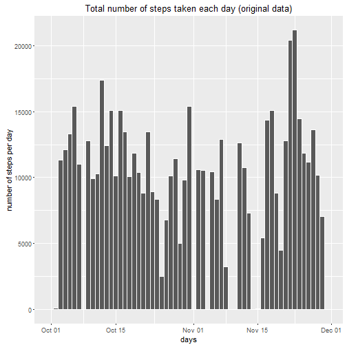
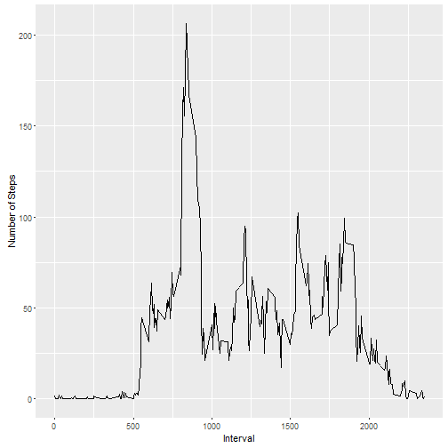
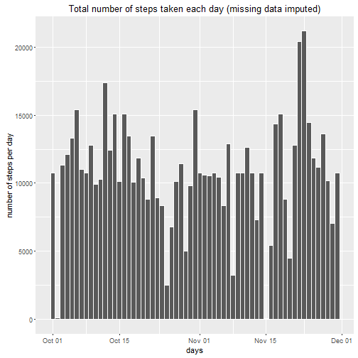

# Report: Week 2 Assignment
The option for echo is set to TRUE below for the entire project.

```r
library(knitr)
opts_chunk$set(echo = T)
```

### Loading and preprocessing the data
After saving the data into the working directory, the data is loaded below. Also, date variable is converted to the Date class.

```r
data <- read.csv("activity.csv", header = T)
data$date <- as.Date(data$date)
```

### What is mean total number of steps taken per day?
The data is split based on the date variable. 

```r
s <- split(data, data$date)
```

Calculate the total number of steps taken per day. Also, results are stored in a data frame.

```r
stepSum <- sapply(s, function(x) sum(x$steps, na.rm = T))
DF1 <- data.frame(days = as.Date(names(stepSum)), steps.sum = stepSum)
```

A histogram is created using ggplot2 to show total number of steps taken per day.

```r
library(ggplot2)
```

```
## Warning: package 'ggplot2' was built under R version 3.2.4
```

```r
ggplot(DF1, aes(days, weight = steps.sum)) + 
        geom_histogram(bins = 61, colour="white") +
        labs(x = "days", y = "number of steps per day") +
        ggtitle("Total number of steps taken each day (original data)")
```



The mean and median of the total number of steps taken per day are calculated, respectively.

```r
mean(DF1$steps.sum, na.rm = T)
```

```
## [1] 9354.23
```

```r
median(DF1$steps.sum, na.rm = T)
```

```
## [1] 10395
```

### What is the average daily activity pattern?
The data is split based on the time interval variable. 

```r
s <- split(data, data$interval)
```

The average number of steps taken across all days are calculated below. Also, results are stored in a data frame.

```r
stepMean <- sapply(s, function(x) mean(x$steps, na.rm = T))
DF2 <- data.frame(intervals = names(stepMean), steps.mean = stepMean)
```

A time series plot of the 5-minute interval (x-axis) and the average number of steps taken across all days (y-axis) is created using ggplot2 as shown below.

```r
qplot(as.numeric(as.character(intervals)), steps.mean, data = DF2,
      geom = "line", xlab = "Interval", ylab = "Number of Steps")
```



The 5-minute interval associated with the maximum number of steps in the time series plot is found as folows.

```r
DF2$intervals[which.max(DF2$steps.mean)]
```

```
## [1] 835
## 288 Levels: 0 10 100 1000 1005 1010 1015 1020 1025 1030 1035 1040 ... 955
```

### Imputing missing values
The total number of missing values in the dataset can be counted as follows.

```r
sum(is.na(data$steps))
```

```
## [1] 2304
```

To impute missing data, a simple strategy was applied; for each missing value the mean value for that specific 5-min interval was used. Please note that the mean for all 5-min intervals was previously calculated and stored in DF2 data frame. A new data frame, namely datanew, was created with the missing data filled according to this strategy.

```r
datanew <- data
for (i in 1:nrow(datanew)){
        if (is.na(datanew$steps[i])) {
                datanew$steps[i] <- DF2$steps.mean[datanew$interval[i] == DF2$intervals]
        }
}
```

With the new data set, a histogram of the total number of steps taken each day is created using ggplot2 and the mean and median total number of steps taken per day are calculated below. Comparing the vlues of mean and median when using the new data set to those of the original data set shows that imputing missing values could significantly affect these values and thus the strategy to use should be carefuly designed. In this example, after imputing missing data using aformentioned strategy, values of mean and median increased from 9354.23 and 10395 to 10766.19 and 10766.19, respectively. In particular, the value of mean significantly increased by about 15%.

```r
s <- split(datanew, datanew$date)
stepSum <- sapply(s, function(x) sum(x$steps))
DF3 <- data.frame(days = as.Date(names(stepSum)), steps.sum = stepSum)
library(ggplot2)
ggplot(DF3, aes(days, weight = steps.sum)) + 
        geom_histogram(bins = 61, colour="white") +
        labs(x = "days", y = "number of steps per day") +
        ggtitle("Total number of steps taken each day (missing data imputed)")
```



```r
mean(DF3$steps.sum)
```

```
## [1] 10766.19
```

```r
median(DF3$steps.sum)
```

```
## [1] 10766.19
```

### Are there differences in activity patterns between weekdays and weekends?
A new factor variable in the dataset is created that shows if a particular date is weekend or weekday.

```r
weekends <- c("Saturday", "Sunday")
datanew$weekend <- factor(weekdays(datanew$date) %in% weekends, 
                        levels=c(FALSE, TRUE), labels=c("weekday", "weekend"))
```

First, the data is split based on the 5-min interval and weekend variables. Sunsequently, the average number of steps taken across all days are calculated showing the average values for all combinations of intervals and weekdays/weekends. Finally, a new data frame, DF4, is created to store the mean results. Additional columns in this data frame presents the 5-min interval and whether the day is a weekend or weekday.

```r
s <- split(datanew, list(datanew$interval, datanew$weekend))
stepMean <- sapply(s, function(x) mean(x$steps))

DF4 <- data.frame(steps.mean = stepMean)
for (i in 1:length(s)){
        DF4$intervals[i] <- strsplit(names(s[i]), "\\.")[[1]][1]
        DF4$wday[i] <- strsplit(names(s[i]), "\\.")[[1]][2]
}
```

A panel plot containing a time series plot of the 5-minute interval (x-axis) and the average number of steps taken across all weekday days or weekend days is created as presented below using ggplot2.

```r
qplot(as.numeric(intervals), steps.mean, data = DF4, facets = wday ~ .
      , geom = "line", xlab = "Interval", ylab = "Number of Steps")
```


